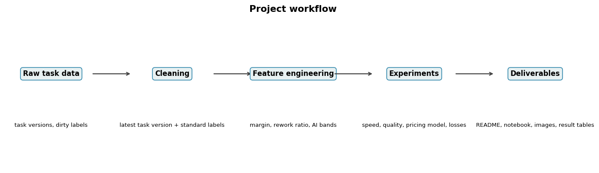
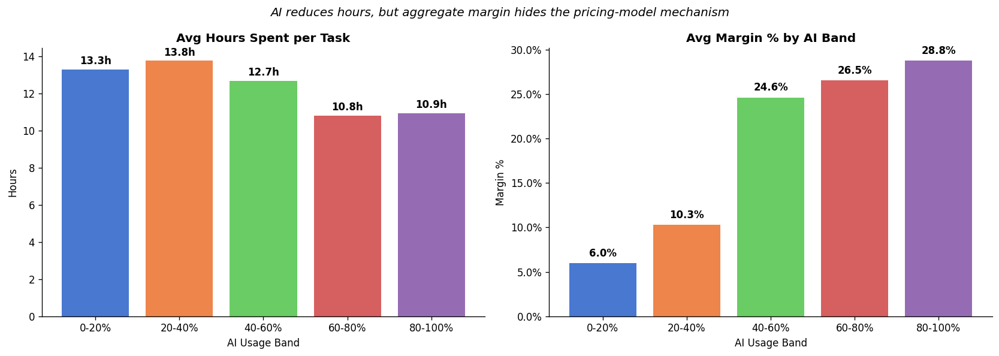
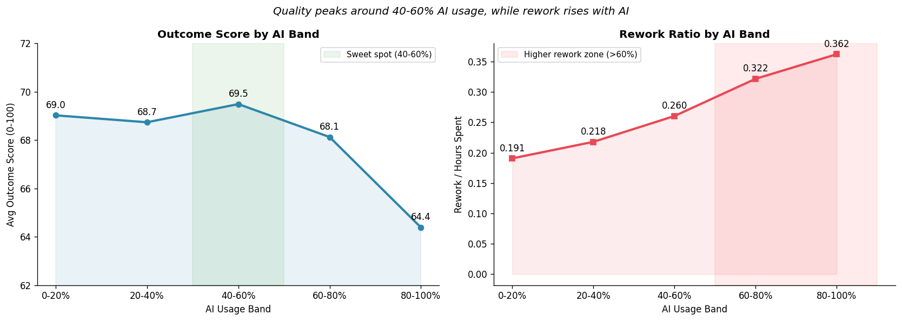
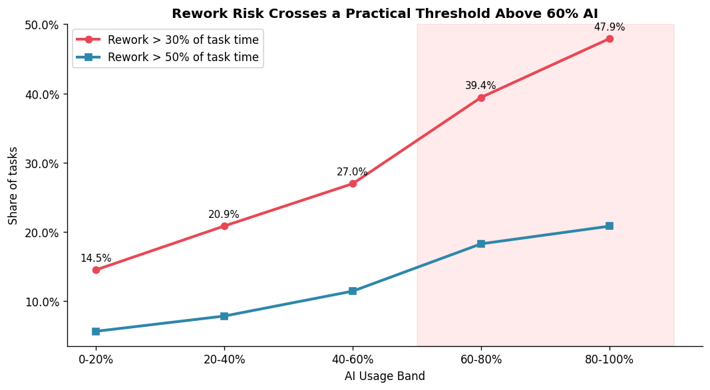
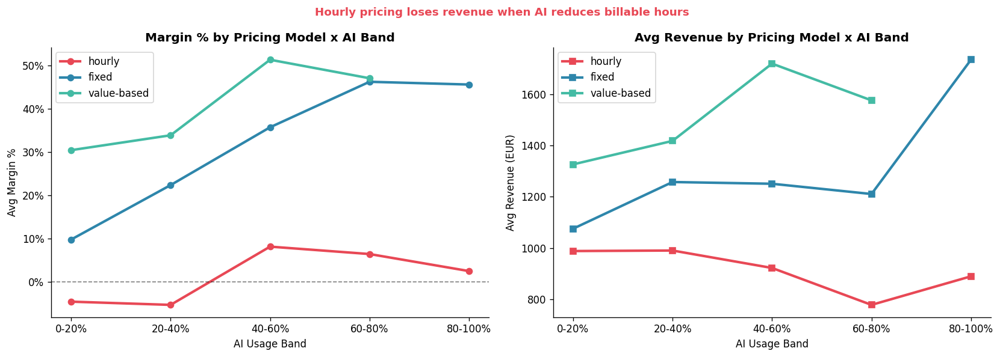
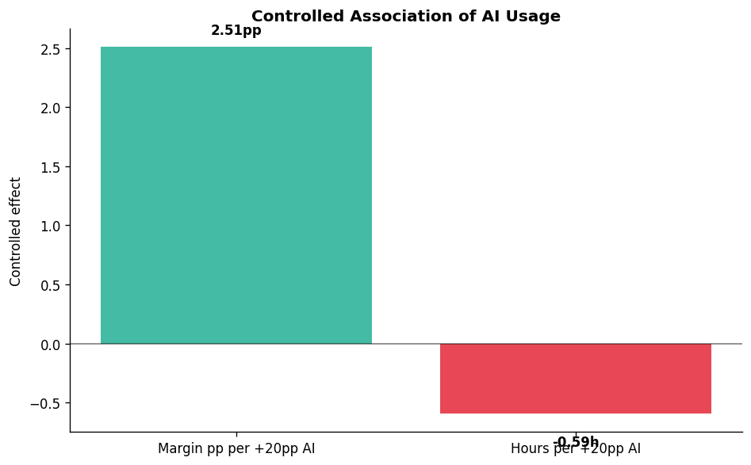
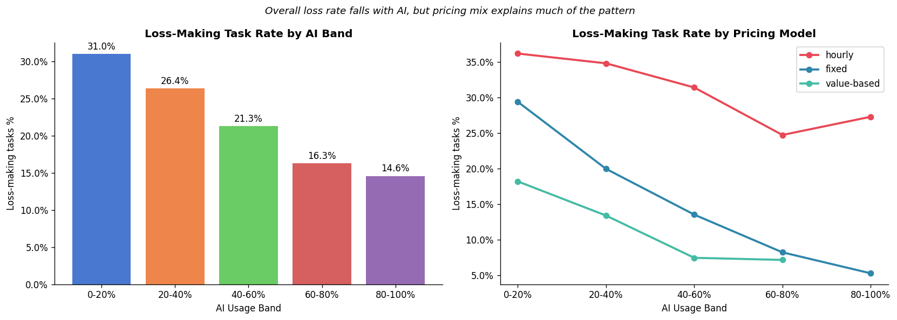
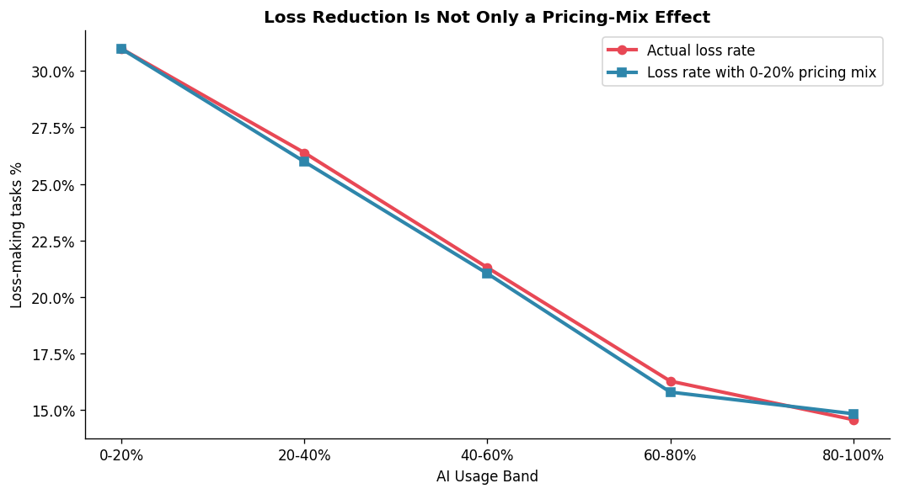

# AI Productivity Analysis - Beyond Efficiency

## Team members

- Nikola Dordevic 811141
- Temirlan Kuralov 818761
- ChenHao Chen 816311


## [Section 1] Introduction

This project studies how AI usage affects productivity and value in a digital agency. The dataset contains 3,248 task records with information about AI usage, hours spent, rework, outcome score, revenue, cost, profit, pricing model, seniority, and task type.

The project question is:

**Does AI usage create real business value, or does it only make work faster?**

The key idea is that faster work is not automatically more valuable. If a company charges by the hour, fewer hours can reduce billable revenue. If a company charges fixed or value-based prices, fewer hours can become higher margin. The project therefore focuses on the mechanism connecting AI usage, speed, quality, pricing model, and margin.

## [Section 2] Methods




The method has five steps:

1. Load the task-level CSV file.
2. Clean dates, categories, and duplicate task records.
3. Engineer business metrics:
   - `margin_pct = profit / revenue`
   - `margin_pct_capped`, capped at the 1st and 99th percentiles for robustness checks
   - `rework_ratio = rework_hours / hours_spent`
   - `is_loss = profit < 0`
   - `ai_band` in five 20-point AI usage bands
4. Run experiments by AI band, pricing model, seniority, task type, loss rate, and controlled models.
5. Generate figures and result tables from the notebook code.

### Design choices

- The task is the unit of analysis.
- Duplicate `task_id` records are treated as task versions; the final notebook keeps the latest `updated_at` row.
- Rows missing `ai_usage_pct` are excluded from AI-band analysis because they cannot be assigned to an AI usage group.
- Rework ratio is capped at the 99th percentile to reduce distortion from near-zero-hour outliers.
- Margin is analyzed both raw and capped because a few extreme negative margins can distort averages.
- The 80-100% AI band has only 48 rows, so it is treated as directional evidence rather than a stable forecast.
- Pricing model is treated as the main explanatory split because it determines whether saved hours become margin or lower revenue.
- The controlled model is used as an association check, not as causal proof.

### Environment

The project was run in the local `labds .venv` Python environment. Required packages are listed in `config/requirements.txt`.

To recreate the environment:

```powershell
python -m venv .venv
.\.venv\Scripts\activate
pip install -r config/requirements.txt
jupyter notebook
```

## [Section 3] Experimental Design

### Experiment 1: AI usage and speed

Purpose: Test whether higher AI usage is associated with fewer hours per task.

Baseline: Low-AI tasks in the 0-20% band.

Evaluation metrics: Average hours spent and average margin by AI band.

### Experiment 2: Speed versus quality

Purpose: Test whether the speed benefit comes with quality or rework cost.

Baseline: Moderate AI usage, especially the 40-60% band.

Evaluation metrics: Outcome score and rework ratio.

### Experiment 3: Pricing model mechanism

Purpose: Test whether AI has different financial effects under hourly, fixed, and value-based contracts.

Baseline: Aggregate analysis without splitting by pricing model.

Evaluation metrics: Average revenue and average margin by `pricing_model x ai_band`.

### Experiment 4: Loss-making tasks

Purpose: Test whether AI reduces the share of tasks that lose money, and whether the aggregate pattern is explained by pricing model mix.

Baseline: Overall loss rate by AI band.

Evaluation metrics: Loss rate overall and loss rate by pricing model.

### Experiment 5: Robustness and threshold analysis

Purpose: Test whether the margin story survives outliers and identify when rework becomes operationally risky.

Baseline: Raw average margin and low-AI rework rates.

Evaluation metrics: Median margin, capped average margin, share of tasks with rework above 30% and 50% of task time.

### Experiment 6: Controlled association model

Purpose: Check whether AI usage is still associated with hours and margin after controlling for pricing model, task type, seniority, complexity, brief quality, and rework.

Baseline: Uncontrolled group averages by AI band.

Evaluation metrics: Controlled effect of a +20 percentage point increase in AI usage on hours and capped margin.

## [Section 4] Results

### Main findings

1. **AI reduces hours.** Average hours fall from 13.3 hours in the 0-20% AI band to 10.9 hours in the 80-100% AI band, a reduction of about 18%.



2. **Quality has a practical limit.** Outcome score is highest around the 40-60% band (69.5) and is lower in the 80-100% band (64.4). Rework rises with AI usage.



3. **The practical risk threshold starts above 60% AI usage.** The share of tasks with rework above 30% of task time rises from 14.5% in the 0-20% band to 39.4% in the 60-80% band and 47.9% in the 80-100% band.



4. **Pricing model is the key mechanism.** For hourly contracts, average revenue falls from about EUR 988 in the 0-20% band to about EUR 778 in the 60-80% band, a drop of about 21%. For fixed and value-based work, saved time is more likely to become margin.



5. **The AI association survives a control check.** After controlling for pricing model, task type, seniority, complexity, brief quality, and rework, a +20 percentage point increase in AI usage is associated with about 0.6 fewer hours and +2.5 percentage points in capped margin. This is not causal proof, but it shows that the pattern is not only a simple group-composition artifact.



6. **Loss-rate improvement is not explained only by pricing mix.** The aggregate loss rate falls at higher AI usage. Reweighting every AI band to the 0-20% pricing mix changes the loss-rate pattern only slightly, so the split by pricing model remains necessary, but the improvement also appears inside pricing models.





### Summary table

| Metric | Value |
|---|---:|
| Raw rows | 3,248 |
| Unique tasks after cleaning | 3,200 |
| Analysis rows with AI usage | 3,057 |
| Hours, 0-20% AI | 13.3 |
| Hours, 80-100% AI | 10.9 |
| Outcome score, 40-60% AI | 69.5 |
| Outcome score, 80-100% AI | 64.4 |
| Rework >30%, 0-20% AI | 14.5% |
| Rework >30%, 60-80% AI | 39.4% |
| Hourly revenue, 0-20% AI | EUR 988 |
| Hourly revenue, 60-80% AI | EUR 778 |
| Hourly margin, 40-60% AI | 8.1% |
| Fixed margin, 40-60% AI | 35.7% |
| Controlled hours effect, +20pp AI | -0.6 hours |
| Controlled capped margin effect, +20pp AI | +2.5 pp |

All detailed result tables are stored in the `results/` folder.

## [Section 5] Conclusions

The main take-away is that AI productivity is not automatically business productivity. AI reduces hours per task, but the value of that reduction depends on the pricing model. Fixed and value-based contracts can capture saved time as margin. Hourly contracts risk giving the benefit away through lower billable revenue. The best business action is therefore not simply to maximise AI usage, but to test fixed-price conversion for selected hourly accounts while monitoring quality and rework.

The operating recommendation is to use 40-60% AI usage as the safest productivity zone: it has the highest average outcome score, strong margin, and lower rework risk than the 60%+ bands. AI usage above 60% should require extra QA because rework above 30% of task time becomes much more common.

The work does not fully answer causal questions because the dataset is observational. We do not know whether AI usage was randomly assigned, which AI tool was used, how many prompts were written, whether rework was caused by AI, or whether the client accepted the work on first delivery. Future work should collect AI-attributed rework reasons, prompt quality, client first-approval rate, and before/after data from a controlled pricing pilot.

## Additional company brief deliverables

### 3 key insights

1. AI creates speed, but speed is not automatically value.
2. Pricing model determines whether AI efficiency becomes margin.
3. Quality is strongest around 40-60% AI usage; above 60%, rework risk crosses a practical warning threshold.

### 1 concrete decision

Run a one-quarter pilot converting selected high-AI, high-revenue hourly accounts to fixed-price packages, but keep production AI usage initially in the 40-60% band. Use the current fixed-contract 40-60% margin benchmark (35.7%) as a comparison point, not a guaranteed forecast. Stop the rollout if converted accounts average below 10% margin after one full quarter, if outcome score falls below the current 40-60% benchmark, or if more than 30% of converted tasks exceed a 0.30 rework ratio.

### 1 thing discovered thanks to AI

The important discovery was not just that AI saves time. The deeper insight was that pricing model decides whether saved time becomes value, while rework decides when speed becomes operational risk. This required slicing the data by `pricing_model x ai_band x margin` and then adding a rework-threshold check.

### 1 mistake made by AI

A first-pass interpretation treated falling aggregate loss rate as proof that AI reduces losses. That was too simple. The pricing-mix decomposition showed that mix alone does not explain the pattern, so the final interpretation became more precise: pricing model changes how AI value is captured, while loss-rate improvement also needs within-model analysis.

### Prompt log

| Prompt-question | What it changed |
|---|---|
| What variables in the dataset are most relevant for analyzing AI productivity and margins? | Helped confirm that hours spent, AI usage %, pricing model, outcome score, and rework were the key variables to focus on. |
| How do hours and margins change across AI usage bands? | Helped interpret the comparison plots showing that higher AI usage reduces hours but does not automatically increase margin. |
| Why does productivity not always increase profit in an hourly model? | Helped identify pricing model as the main mechanism explaining the difference between speed and value. |
| At what AI usage level does rework become operationally dangerous? | Led to the 30% and 50% rework-threshold analysis. |
| Could the margin pattern be caused by outliers? | Led to capped margin and median margin robustness checks. |
| Is the loss-rate pattern only a pricing-mix effect? | Led to the pricing-mix decomposition using the 0-20% band as the reference mix. |
| Can we check the AI association after controlling for task type, seniority, pricing, and complexity without adding new libraries? | Led to the dependency-free `numpy` OLS control model. |
| What is the most concrete business decision from these results? | Helped refine the pilot recommendation with stop conditions for margin, outcome score, and rework. |

## Folder contents

- `presentation/deck.html` - final HTML presentation deck.
- `presentation/deck-stage.js` - local deck navigation component.
- `presentation/Presentation.pptx` - exported PDF deck, if present.
- `notebooks/main.ipynb` - final notebook name.
- `README.md` - project explanation and final conclusions.
- `config/requirements.txt` - Python environment requirements.
- `data/ai_productivity_dataset_final.csv` - dataset used by the project.
- `images/` - figures generated from the notebook and used in this README.
- `results/` - CSV result tables generated from the notebook.
